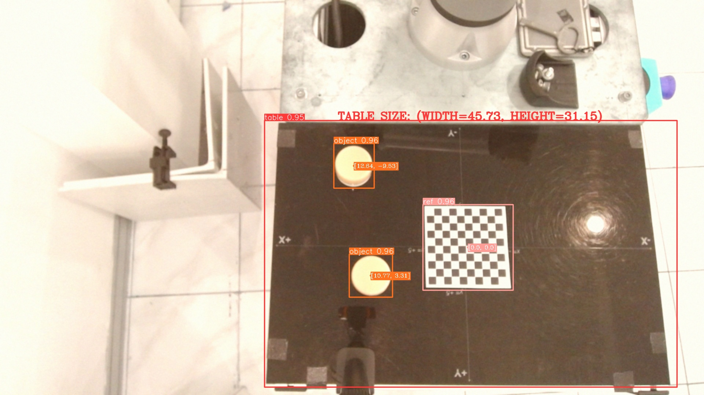

# Freelance project for object detection

The data is stored in the `data` directory in this repository.
The trained model is in the PyTorch format, and is stored in the `models` directory.

The inference process not only localize and detect the object within the image, but also estimate the coordinates of the object(s) appearing in the image. This coordinate is estimated based on the reference object (checkerboard square) that was always appearing in the image. Using this information, we can determine the origin of coordinates. Also, we can determine the table size.

## Inference usage
For inference the trained model, run the following command:
```
python infer.py --source /path/or/dir/to/image --data /path/to/yaml/file.yaml --weights /path/to/model.pt --save-csv
```

### Example of the inference result:


## Data preprocessing
Before training the model, we need to preprocess the image data and label data. First, we need to convert the label format from .json to .txt format. 

### Annotation format conversion
Run the following command:
```
./convert_labels_in_a_dir.sh <folder_path>
```

### Image augmentation
The next preprocessing step is to augment the image using image transformation algorithms either to transform the brightness, sharpness, or color of the image.

To implement the following steps, run this script:
```
python datasets/prepare_dataset.py --target-directory /dir/to/preprocessed/data --test-size 0.2
```
`--test-size` is the proportion of the test size to split while augmentations are applied.

### Training process
This repository applies the training algorithm using the YOLOv5 model. Clone this repository first: https://github.com/ultralytics/yolov5

Follow the installation process, including the ultralytics module.

Then, add this text to .yaml file that you need to save in the specified directory within the cloned yolo directory.
```yaml
# YOLOv5 🚀 by Ultralytics, AGPL-3.0 license
# COCO128 dataset https://www.kaggle.com/ultralytics/coco128 (first 128 images from COCO train2017) by Ultralytics
# Example usage: python train.py --data coco128.yaml
# parent
# ├── yolov5
# └── datasets
#     └── coco128  ← downloads here (7 MB)

# Train/val/test sets as 1) dir: path/to/imgs, 2) file: path/to/imgs.txt, or 3) list: [path/to/imgs1, path/to/imgs2, ..]
path: /dir/to/dataset # dataset root dir
train: train # train images (relative to 'path') 128 images
val: test # val images (relative to 'path') 128 images
test: # test images (optional)

# Classes
names:
  0: 'table'
  1: 'ref'
  2: 'object'
```

Finally, run the following command to train the model using prepared datasets:
```
python train.py --img 640 --epochs 10 --data v2.yaml --weights yolov5s.pt
```